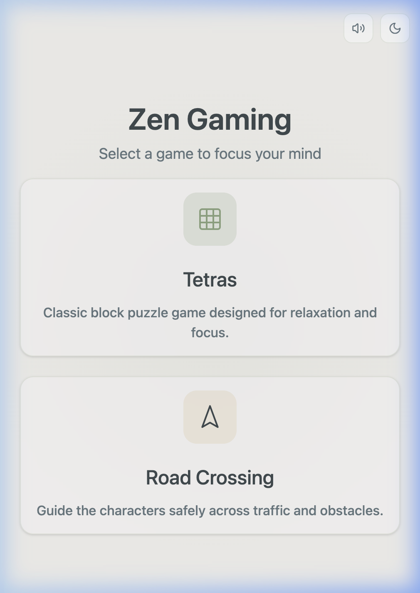
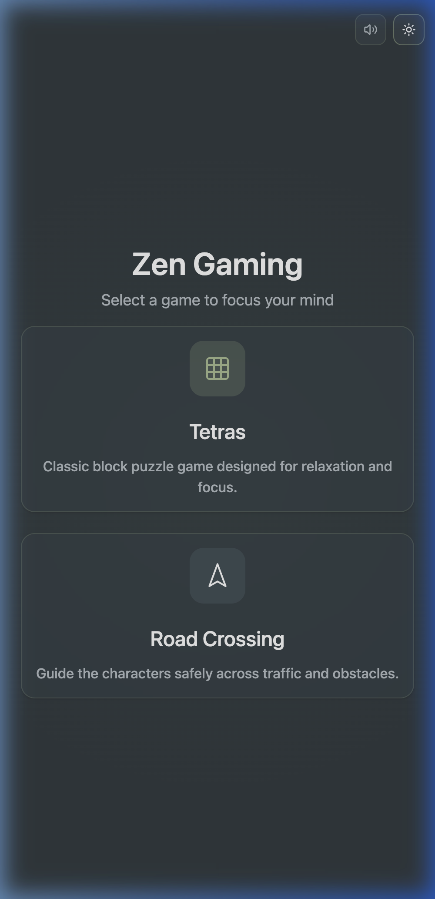
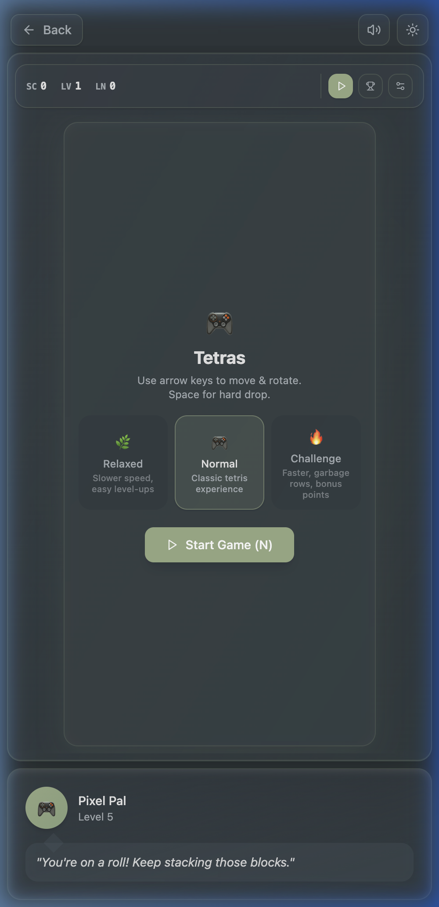
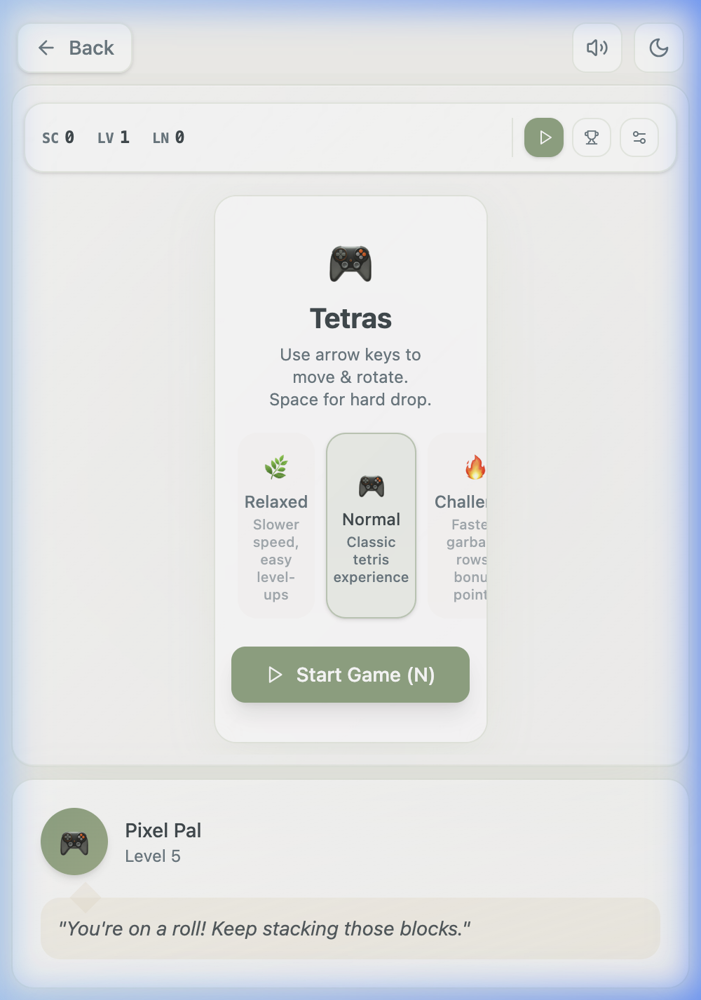
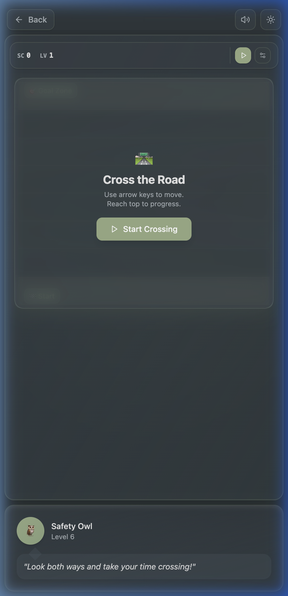
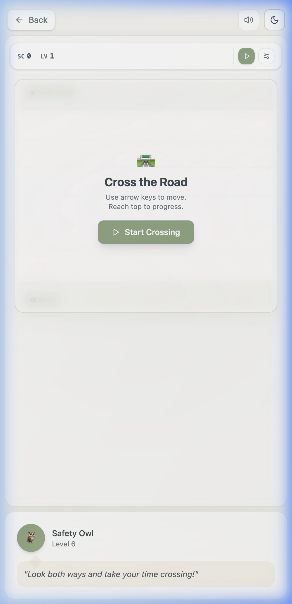

# Zen Games — VS Code Extension

> Take a mindful break without leaving your editor. Zen Games is a VS Code extension that brings a curated collection of calming mini-games directly into your sidebar or main editor panel.

---

## Overview

Zen Games lives in the Activity Bar sidebar, giving you instant, one-click access to a game whenever you need a short mental reset. A single **Expand** button pops the game into a full main-editor panel for a more immersive experience—no context switching, no new windows.

The extension automatically syncs state between the sidebar and the expanded editor panel: closing the full-panel view seamlessly returns focus to the sidebar, right where you left off.

---

## Screenshots

### Landing Screen — Light & Dark Mode

The game picker adapts to both VS Code light and dark themes. A theme toggle in the top-right corner lets you switch on demand.

<p align="center">
  
  &nbsp;&nbsp;&nbsp;
  
</p>

### Tetras — Block Puzzle

Tetras is a zen-tuned Tetris variant. On launch you choose a difficulty mode—**Relaxed**, **Normal**, or **Challenge**—each adjusting fall speed, level-up cadence, and whether garbage rows appear. Your companion **Pixel Pal** cheers you on from the bottom of the sidebar.

<p align="center">
  
  &nbsp;&nbsp;&nbsp;
  
</p>

### Road Crossing

Guide your character safely across a multi-lane road using the arrow keys. The **Safety Owl** companion keeps you motivated at the bottom of the panel. Score and level are tracked in real time.

<p align="center">
  
  &nbsp;&nbsp;&nbsp;
  
</p>

---

## Features

| Feature                  | Details                                                                                   |
| ------------------------ | ----------------------------------------------------------------------------------------- |
| 🎮 **Tetras**            | 3-difficulty Tetris (Relaxed / Normal / Challenge) with score, level & line tracking      |
| 🚗 **Road Crossing**     | Arrow-key frogger-style game with progressively harder traffic                            |
| 🌗 **Theme Toggle**      | Switch between light and dark mode at any time                                            |
| 🔊 **Sound Toggle**      | Mute / unmute in-game audio with one click                                                |
| ↩ **Back Navigation**    | Return to the game picker from any game without reloading                                 |
| 🖥 **Expand to Editor**  | Pop any game into the main editor column via the `⤢` icon in the sidebar title            |
| 🔄 **State Sync**        | Sidebar and expanded editor stay in sync; closing the panel returns the sidebar to normal |
| 🤝 **Companion Panel**   | Each game has a levelled companion character with contextual tips                         |
| 📐 **Responsive Layout** | Works in the narrow sidebar _and_ in wide editor panels                                   |

---

## How It Works

### Architecture

```
VS Code Extension Host
│
├── extension.ts          ← Activates, registers the sidebar WebviewView
│                           and the "zen-games.expand" command
│
└── WebView (React App)
    ├── App.tsx           ← Root: manages active view, theme, expand-sync state
    ├── LandingView       ← Game picker cards
    ├── BlocksView        ← Tetras game + Tetris engine
    ├── RoadCrossingView  ← Road Crossing game
    ├── CompanionPanel    ← Per-game companion character + tips
    └── TopControls       ← Back button, sound toggle, theme toggle
```

### Sidebar ↔ Editor Sync

When you click the **Expand** (⤢) button in the sidebar title bar:

1. `extension.ts` creates a new `WebviewPanel` in `ViewColumn.One` with `retainContextWhenHidden: true`.
2. The extension immediately `postMessage`s `{ command: 'sync-state', isExpanded: true }` to the sidebar webview.
3. The sidebar React app receives the message and renders a **"Playing in Main Editor"** placeholder, so the sidebar doesn't fight for input focus.
4. When the expanded panel is closed, the extension fires `sync-state` again with `isExpanded: false`, and the sidebar resumes normally.

### Theme Detection

The app detects VS Code's theme class on `document.body` (`vscode-light`, `vscode-dark`, `vscode-high-contrast`) and maps it to Tailwind's `dark` class so CSS variables resolve correctly inside the WebView.

---

## Getting Started

### Install from Marketplace

1. Open the **Extensions** view in VS Code (`Cmd/Ctrl + Shift + X`).
2. Search for **"Zen Games"**.
3. Click **Install**.
4. The Zen Games icon appears in the Activity Bar — click it to open the panel.
5. Pick a game and start playing.

---

## Game Controls

### Tetras

| Key       | Action                    |
| --------- | ------------------------- |
| `←` / `→` | Move piece left / right   |
| `↓`       | Soft drop (faster fall)   |
| `↑`       | Rotate piece clockwise    |
| `Space`   | Hard drop (instant place) |
| `P`       | Pause / Resume            |

### Road Crossing

| Key       | Action                          |
| --------- | ------------------------------- |
| `↑`       | Move character up (toward goal) |
| `↓`       | Move character down             |
| `←` / `→` | Move character left / right     |

---

## Requirements

- **VS Code** `^1.107.0`
- No additional runtime dependencies — everything is bundled inside the extension.

---

## Extension Commands

| Command            | Trigger                   | Description                                 |
| ------------------ | ------------------------- | ------------------------------------------- |
| `zen-games.start`  | Command Palette           | Focus / open the Zen Games sidebar          |
| `zen-games.expand` | `⤢` icon in sidebar title | Expand the active game into the main editor |

---

## License

MIT — see [LICENSE](LICENSE) for details.
